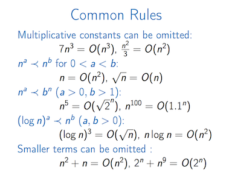
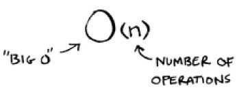

For many self-taught developers who are looking for a career in Software Engineering, we rightly focus on the skills that are most likely to help us get employed the quickest. Unfortunately doing so we naturally neglect some of the foundations to our learning. We are at a significant disadvantage in the job market compared to others like Computer Science students who have a much broader, and often deeper, range of knowledge when it comes to the theoretical aspects of software development.

Since starting my first job as a Software Engineer I wanted to ensure that I not only developed my skills further, but also "filled" those many knowledge gaps that still existed.

My plan is to create a series of blog posts each focussing on a different topic which I have been learning. The first one: the Big 0.

Let's begin...

## What is the Big 0? 🤔

There are many different definitions of the Big 0. The Wikipedia definition defines it as such:

>*A  mathematical representation that describes the limiting behavior of a function when an argument tends towards a particular value or infinity*

I didn't resonate with this definition. It's way too wordy and, well, it's just awful. Instead I created my own definition:

>*the language computer people use to talk about how fast or slow an algorithm is, or how much memory is used*

Note to self: *"oh yeah, I'm also one of those computer people now"* 😅

## What does the Big 0 look like? 😈

Calling it the Big 0 makes it sounds like it is some kind of mythical creature, some scary being. In fact, that's not far off the truth:

The "Big 0" from [here](https://cartoonnetwork.fandom.com/wiki/The_Big_O)

This is what the Big 0 looks like if you're familiar with Japanese anime TV. Unfortunately, this is not the kind of Big 0 we're dealing with. The Big 0 we're dealing with is much, much scarier:

Big 0 Notation from [here](https://www.coursera.org/learn/algorithmic-toolbox)

## Why do we need Big 0? 🧐

**Consider this.**

You have the same algorithm but it is run on different computers. What could affect the results? The size of the input could affect the results. The CPU could affect the results. The system architecture could affect the results. The compiler used could affect the result etc. This list goes on. There are too many external variables to state. 

**Now consider this.**

>Write a function that takes in a string and reverses it.

Believe it or not, there are at least 10 different ways of achieving this in JavaScript. See [here](https://stackoverflow.com/questions/958908/how-do-you-reverse-a-string-in-place-in-javascript). So how do we analyse these solutions? How do we know what algorithm is most efficient? Which one will run the fastest? But is this enough to know? Example 1 could run really fast with just 10 inputs, but what about 1000 inputs? What about 1000000 inputs?

Hopefully you can imagine these considerations would make it almost impossible to analyse how efficient an algorithm is if we didn't have a language or system to remove as many potential influencing variables as possible. This is why Big 0 was created.

Big 0 uses what is termed as **asymptotic notation** to assess how efficient (fast or slow) an algorithm is as the *size of the input grows*.

## Asymptotic Notation

Those funny looking symbols you saw in an above image is what is called asymptotic notation. It is the language used to describe the efficiency of an algorithm as the size of the input grows. What this means is that how does the algorithm "scale up" as the data passed in grows larger and larger.

For example, a given algorithm could be super fast at processing a small amount of data, but as this data grows larger and larger, the algorithm's speed grows larger and larger.

What asymptotic notation allows us to do is to express the efficiency of an algorithm in a simplified, clear way, and to use that algorithm's Big 0 to others in order to decide which one is most efficient. 

Asymptotic notation looks like this:

Asymptotic notation from [here](https://www.freecodecamp.org/news/Big-o-notation-simply-explained-with-illustrations-and-video-87d5a71c0174/)

## The Big 0's you need to know ❗️

The Big 0 above, 0(n), is referred to as linear time. This means that as the input size grows (i.e. no. of operations), the time taken to complete the algorithm grows at a linear rate. For example, if 100 operations takes 0.1 seconds, 200 operations takes 0.2 seconds, and 1000 operations takes 1 second.

Linear time could be considered an average time for Big 0. Others are much worse (slower), and others are much better (faster).

Below are some of the more important ones to know about:

- 0(n^2) - Quadratic
- 0(n log n) - Loglinear
- 0(log n) - Logarithmic

If you'd like to learn more detail about these Big 0's, check out [this](https://github.com/pavankat/Big-o-in-plain-english).

A good way to visualise how different Big 0's compare to one another is through plotting each on a graph:

Big-Complexity Chart from [here](Bigocheatsheet.com)

## To sum up 👏...

- Big 0 is a way of describing the efficiency of an algorithm.

- Asymptotic notation is the language used to describe a Big 0 - e.g. 0(n)

- Learning Big 0 will help you understand how to design algorithms, and software in general, and will come in very useful for coding interviews at large companies.

- Big 0 is intrinsically linked to data structures and algorithms. We will cover both of these topics in the next blog posts 🙂