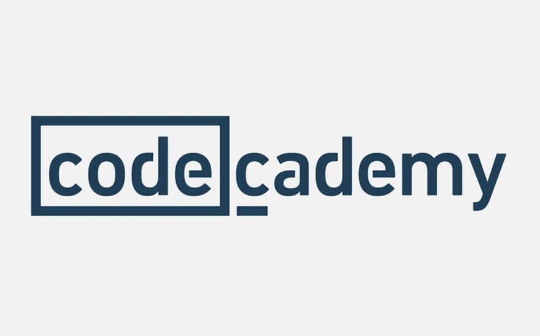
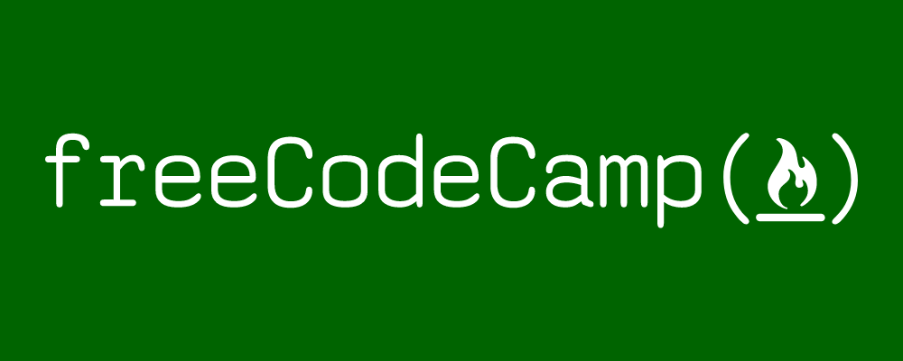
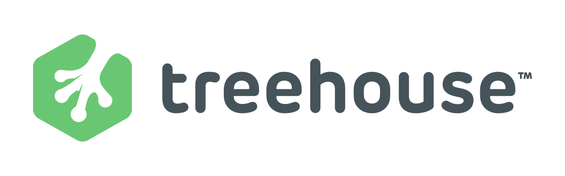

In this post I want to share with you the resources I used to learn how to code. Due to the vast amount of resources available, it is easy to become overwhelmed. It's also difficult to know which ones are best to begin with. Below are the top three resources I recommend if you're getting started (in no particular order):

If you simply type 'how to learn to code' into Google, one of the first links you'll come across is  [Codecademy](https://www.codecademy.com/). Codecademy was the first website I started with. It did a fantastic job of introducing me to HTML and CSS. Their inbuilt text editor with automatic preview were great in providing me with realtime feedback and changes to my code. Seeing changes occur right in front of my eyes was both very satisfying and great for demonstrating how the changes to my code reflected changes to the structure or styling of a webpage. The tutorials helped me "dip my toes in the water" of web development. It essentially helped provide me of a good overview of how a webpage is constructed.

The only downside that I found using Codecademy was that they purposely "hold your hand" through most of the tutorials. Whilst this is invaluable to begin with, it quickly becomes a hinderance. Without "thinking for yourself" there is a concern that what you learn isn't retained, or even goes deep enough for you to fully understand a given topic. Which leads us into...

After I felt I had a good grasp on HTML and CSS, it is natural to progress to learn the basics of JavaScript. I used [freeCodeCamp]([https://www.freecodecamp.org/](https://www.freecodecamp.org/)), a non-profit organisation, to learn how to 'properly' code. Properly being that HTML and CSS are Markdown and Styling lanuages, respectively. They are not a Programming lanuguage i.e. they cannot write instructions through code to a computer in order for the computer to perform actions.

**Warning: preach alert**...

This is where I talk about how amazing freeCodeCamp is. I would estimate that 70% of my learning time came from using freeCodeCamp. Here is why:

Firstly, it places an emphasis on interactive learning and realtime feedback. It does this by splitting up a subject into many bite-sized exercises. With each exercise you learn a specific thing and then use that knowledge to pass an exercise using an in-built text editor. There are pre-defined unit tests which aren't visible to the user but which all must pass before you can move onto the next exercise. This method of learning really helped me apply my recently learnt skills and develop my problem solving ability. 🧠
 
Secondly, in order to "pass" a certain topic, like front-end web development, you are encouraged to apply what you have learnt into projects. This really provides one with encouragement and reassurance that you are actually learning. It also provides you with something to show to others, which I personally found really important. This really helped with my desire and motivation to keep learning and moving onto further projects. There are a selection of different projects to choose from. Make sure you choose one that interests you. Check out my GitHub if you're interested in looking at some of the ones I did during my learning. 👍

Finally, this is probably the most important of all benefits of freeCodeCamp - the community. freeCodeCamp's community is a fantastic, supportive set of individuals guided by the CEO Quincy Larson. There are Forums, a YouTube channel, a blog (recently moved from Medium to hosted by freeCodeCamp), Podcasts etc. 

Most of us when learning to code do so in isolation and that can be bitter sweet. On one hand it can be a blessing as you debug problems yourself and learn how to search for the answers on Google, which ends up being a valuable skill. And on the other hand it can be a real struggle when you inevitably run into trouble with your learning or projects. The freeCodeCamp community were fantastic at helping me answer questions, point me in the right direction, give me reassurance etc. They're a wonderful set of people who I'm very grateful for. 🙏

This is the *only* website I actually paid for whilst learning. And there is a reason for this.

The content and videos [Team Treehouse]([https://teamtreehouse.com/](https://teamtreehouse.com/)) produce are exceptional quality. Check out the following to see what I mean:

There is a wide variety of different courses to learn and they organise learning into specific career paths you may choose. For example, there is a Front-End Web Development path, a Back-End one, Full-Stack,  a Data Science path - plus much more! I followed the Front-End Web Development path which I highly recommend. They go in depth on topics such as HTML, CSS, jQuery, JavaScript, React, Git, AJAX and even things like Web Performance Optimisation!

Other advantages of using Team Treehouse was their focus on information retention. They do this by making you complete quizzes mid-tutorial, mini-projects to complete and other challenges throughout. Also their memberships are really flexible and you can pause subscription and easily go back to it after *x* amount of weeks.

## To sum up... 👏

There are *many* superb resources out there that you can use to learn how to code - these are just the ones that worked for me. And that's the thing: you have to find what works for you. For me, I loved freeCodeCamp because of their emphasis on learning-by-doing. Others will prefer a more "hand holding" type of learning like what Codecademy provides (no disrespect to Codecademy - they're great 👊). And others will provide a more visual type of learning like watching YouTube tutorials.

But I hope that if you are overwhelmed by which resource you should try, I hope that this post has helped clarify some of that confusion for you! 🙂