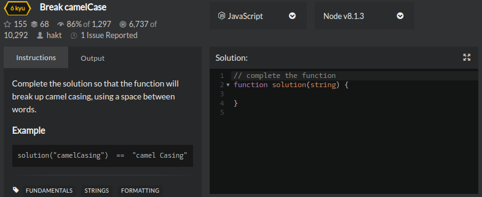

There's a constant debate about what is the "best" way into Programming:

Computer Science?
Coding Bootcamps?
Self-taught?

In my opinion, as with many things, there are pros and cons to both. My route into Programming was the self-taught route, mainly due to my circumstances at the time (working a full time job, family to support, bills to pay etc.). Whilst I will probably talk about the pros of being a self-taught Programmer in another post, right now I want to share my thoughts on some of the cons of being self-taught and how they can be addressed.

### The self-taught route

People code for different reasons. Some do out of interest, some do out of requirement for their jobs. But I'd say a large proportion of people who teach themself how to code usually do so because they want a career in that field. This was the case for me.

I've always been interested in technology and computers. Computers have always fascinated me. I've always wanted to understand how they _actually_ work. Especially over the past few years with the increase in the technology and the growth in fields like AI and robotics.

So when I realised I could teach myself how to code, that I could contribute to the industry, that I could make a career out of it - it was an opportunity I had to take!

### Pitfalls of being a self-taught developer

If you teach yourself how to code, you kind of do it from the top-down. You learn the purpose of the language, you learn the basic syntax, you create a Hello World app, you follow along with tutorials, you're guided through projects. Learning this way is necessary. You _need_ to practice what you're learning, memorise the basics of the language and keep motivated by building things.

However, doing so comes with pitfalls. You predominantly learn through memorising. You don't understand the _why_, you learn the _how_. This leads to a limited understanding of the concepts that underpin languages, coding, and software development in general.

It's like constructing a house on poor foundations. You've got something up, it does a job, but you're not sure how it's actually worked, and if it's tested... well! 😬

Photo by [Arnold Dogelis](https://unsplash.com/@adogelis) from [Unsplash](https://unsplash.com/)

So, what can you do about it?

### Why I'm learning Computer Science

The answer: learn Computer Science.

When I say learn Computer Science though, I don't mean go and get a degree in it. What I mean is learn the specific Computer Science subjects/concepts that the field of Software Engineering is built on.

Following advice from other engineers, and what I've researched, the following topics are advised.

### Problem Solving

Problem solving is the meta-skill. It is one which self-taught engineers aren't taught. 

Problem solving isn't a skill that is taught per se, but one that is developed through practice.

It's something which I'm putting a lot of time into right now. I've been reading several books and watched some videos around the subject, but like I said, it is something that you need to practice in order to improve.

There are many different platforms which help with developing problem solving skills. Some of these include HackerRank, LeetCode and CoderByte. I've found these sites are very focussed around interview preparation, which is great if that's something you're working towards, but personally I don't find them very fun and therefore I quickly lose motivation.

One site I can highly recommend though which is "fun" - depending on your definition! - is CodeWars. I really like this site because the challenges are small, well-defined and generally more engaging as it is less focussed around "mathy" interview questions.

### Data Structures and Algorithms

Data structures and algorithms are another topic which are often used in coding interviews. They are intertwined with Big 0 notation, which is the way of analysing the efficiency of computer data structures or algorithms.

Essentially, data structures and algorithms are a fundamental topic in Programming as they are the things we use to create the program itself. The data structures are how we store and organise the data, and the algorithms are the repeatable set of instructions that act on the data.

Depending on your role, front end vs. back end, and the language you use, will depend on how well you need to know certain data structures and algorithms. For example, if you're a Front End engineer using JavaScript, most of the data structures and algorithms are built-in to the language, whereas if you're using C on the Back End you will need to deal more directly with the data structures i.e. creating a linked list, allocating memory for an array.

But at the end of the day, it is important to have a solid understanding of data structures and algorithms regardless. Even if you aren't explicitly creating and managing the data structure yourself using JavaScript, you are interacting with a tree data structure in the form of the DOM in a browser, so understanding how and why this is structured like so is important.

I recommend this [book](https://www.amazon.co.uk/Common-Sense-Guide-Data-Structures-Algorithms-ebook/dp/B075FZ9P7N/ref=tmm_kin_swatch_0?_encoding=UTF8&qid=&sr=) which a colleague of mine lent me to learn more about this topic. I found this book really interesting and down-to-earth, and less dry than most other books on this subject.

### Programming

There's a mental debate I have with myself every so often around the terms **coder**, **developer**, **programmer** and **engineer**. These terms are used interchangeably, but I think they all have different meanings.

Where I'm going with this is that when I say I taught myself how to code, I am referring to the fact that I taught myself the basics of a language. When I say I'm teaching myself to be a programmer, I am referring to teaching myself how to not only create programs with syntax, but also to have a solid understanding of the fundamental building blocks used to create all computer programs.

So in order to do this, you have to take a step back from a specific language in general and look at languages as a whole. I've needed to understand that all languages and programs are comprimised of certain core fundamentals:

- variables
- values
- conditional statements
- loops
- functions

By having a good grasp on programming fundamentals I'd argue that not only does it help you get a better understanding of the language(s) you use, but it also helps you pick up and understand other languages in the future.

### Computer Architecture/Operating Systems

Understanding computer architecture is to understand what is going on in the computer below the surface of software. Being a Software Engineer working on the Web, I tend to only really see the highest layer of computer architecture. And one could argue that to succeed as an Engineer at that level it isn't _necessary_ to learn "deeper" layers than that.

However, I not only find computer architecture interesting, I would also say learning it help become a better engineer.

I'm reading this [book](https://www.amazon.co.uk/Code-Language-Computer-Hardware-Software/dp/0735611319) at the moment, which even though at times it gets very technical, and I'm learning so much. And I'm already starting to see the benefit of doing so.

I'm currently learning Node.js which is a JavaScript library that executes code outside of the browser. Its primary behaivour is to process instructions asynchronously. And doing so makes it really efficient for I/O operations. And until recently, none of this stuff I've just wrote about Node made sense to me.

But as I've been learning about CPU and RAM, I now have a understanding of why Node is really efficient for I/O operations. Without my (still very limited) understanding of computer architecture and hardware it would have took me a while to understand why Node is efficient in this example.

It has also been recommended to deepen your knowledge of operating systems, which makes sense because we interact with them directly on a daily basis as Programmers.

### Other subjects

There are many other subjects involved in Computer Science that may be beneficial to learn. These include:

- Networking
- Databases
- Math for CS
- Distributed systems
- Machine Learning

Personally, I feel that the other subjects I've discussed above will probably give you the most "bang for your buck" in terms of time spent vs. relevant knowledge learnt (with the potential exception of networking).

One subject that I might consider looking a bit deeper into at some point is compilers. I use JavaScript right now so I don't deal with compilers directly as it is an interpreted language. But in the future I'm interested in learning more lower level languages where you manually use compilers to compile your source code into machine code. Regardless, understanding how code is translated into machine code from all levels is useful information.

### Resources

If you're interested in learning more about some of the areas I've discussed, check out the following list of resources that I can recommend:

- [CS50 (2020)](https://cs50.harvard.edu/x/2020/)
- [Code: the hidden language of computer hardware and software]((https://www.amazon.co.uk/Code-Language-Computer-Hardware-Software/dp/0735611319))
- [OSSU](https://github.com/ossu/computer-science)

Also, check out the following link, which contains many more recommendations and is the primary source of information I used for my learning:

🔑 [Teach Yourself Computer Science](https://teachyourselfcs.com/)

### In Summary

If you are planning on learning the fundamentals of Computer Science, I hope I've given you some food for thought. So far what I've learnt has not only been fun and interesting, but more importantly I feel like it's given me a better understanding of how computers work which in turns helps me in my job as a Software Engineer. How far you go is up to you, but let your curosity and interest dictate that! 😄
